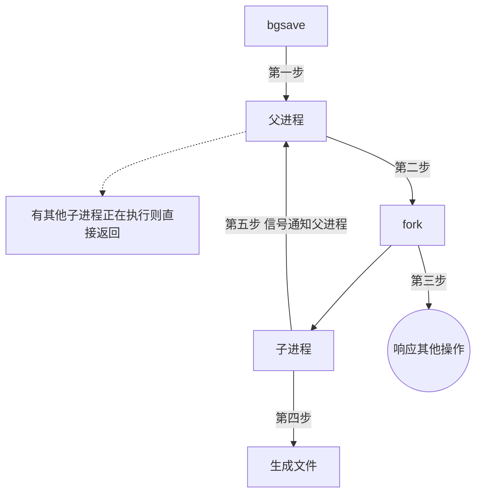

[TOC]

# RDB 的持久化方式

## 介绍

RDB 的方式是把当前 Redis 进程中的数据通过快照的方式持久化到硬盘的方式。

## RDB 的触发

RDB 持久化方式的触发分为自动触发和手动触发。

### 1. 手动触发

手动触发使用命令执行，分为 `save` 和 `bgsave`

1. `save` 命令会阻塞 Redis，直到 RDB 持久化过程完成，因此不建议线上使用

    > 运行 save 命令会打印日志：`* DB saved on disk`
    >
    
2. `bgsave` 命令会在主线程执行 fork 操作创建子线程，RDB 的持久化过程交给子线程完成，阻塞只发生在主线程的 fork 阶段，一般时间很短

    > 执行 bgsave 命令会打印日志：
    >
    > `* Background saving started by pid 3151`
    > `* DB saved on disk`
    > `* RDB: 0 MB of memory used by copy-on-write`
    > `* Background saving terminated with success`

现在，Redis 中所有涉及 RDB 的操作都会采用 `bgsave` 方式，`save` 已经被废弃了。

### 2. 自动触发

自动触发的方式包括：

1. 在内部文件中配置了 `save m n` 的内容，表示在 m 秒内进行了 n 次修改，就会触发 `bgsave` 命令
2. 主从复制中执行全量复制的场景，主节点会主动执行 `bgsave` 操作来进行持久化，生成 RDB 文件发送给从节点
3. 执行 `debug reload` 操作的时候，Redis 会重新加载，触发 `save` 操作
4. 客户端执行 `shutdown` 操作时，在没有开启 AOF 方式的情况下会触发 `bgsave` 操作 

## 运行流程

既然 bgsave 为 RDB 的主要执行方式，按照 bgsave 的方式运行流程如下：

1. 执行 `bgsave` 操作后，父进程会判断现在是否有正在运行的子进程（AOF 和 RDB）。如果存在则直接返回

2. 父进程执行 fork 操作创建子进程，期间父进程会阻塞

    > `info stats` 命令的 `latest_fork_usec` 可以获取最近一个 fork 操作的耗时（微秒）

3. 父进程结束 fork 后，bgsave 会返回“Background saving started”，继续响应其他命令

4. 子进程开始创建 RDB 文件，根据父进程内存生成临时快照文件，完成后对原有的 RDB 文件进行替换

    > info 统计中的 `rdb_last_save_time` 可以获取最后一次生成 RDB 文件的时间
    >
    > 执行 `lastsave` 命令也可以

5. 子进程发送信号给父进程，父进程更新统计信息

    > 对应 `info persistence` 下的 `rdb_` 开头的相关信息

## RDB 文件

### 关于 RDB 文件的配置

1. 保存位置：`dir`

    可以使用 `config set` 进行动态修改

2. 保存文件名称：`dbfilename`

    可以使用 `config set` 进行动态修改

    > `dir` 和 `dbfilename` 动态修改后会在下次使用新配置。解决服务器出现坏盘或者磁盘写满的情况。
    >
    > 配置同样适用于 AOF 持久化方式。

3. 是否进行文件压缩：[rdbcompression {yes|no}](x-devonthink-item://DA15BEB3-A579-4509-8A41-AADDB017E206?line=240) （默认开启）

    > 默认采用 LZF 算法对生成的 RDB 文件做压缩处理，压缩后的文件远远小于内存。
    >
    > 压缩 RDB 会消耗 CPU，但可大幅降低文件的体积，方便保存到硬盘或通过网络发送给从节点，线上建议开启。

### 文件校验问题

如果在启动的时候加载了损坏的 RDB 文件，会输出如下日志：`# Short read or OOM loading DB. Unrecoverable error, aborting now.`。

Redis 提供了 `redis-check-dump 工具`可以对 RDB 文件进行检测并获取对应的报告信息。

## 评价 RDB 方式

### 优点

1. RDB 生成文件代表某个时间点的数据快照，可以为紧凑型二进制文件，它的体积更小。更适合数据备份和全量复制后的发送场景。一般可以用于容灾恢复
2. Redis 重启后加载 RDB 文件的速度要远远快于 AOF 方式

### 缺点

1. RDB 的父进程 fork 操作属于重量级操作，不适合实时持久化的情况。在频繁执行的时候成本过高
2. RDB 的文件内为紧凑型二进制，不可读
3. 生成文件的方式在不同版本中可能不一样，会存在老版本不兼容新版本的情况

针对这些缺点，Redis 提供了 AOF 的持久化方式。