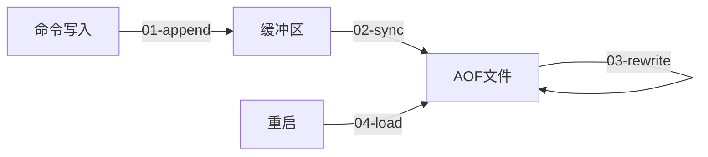
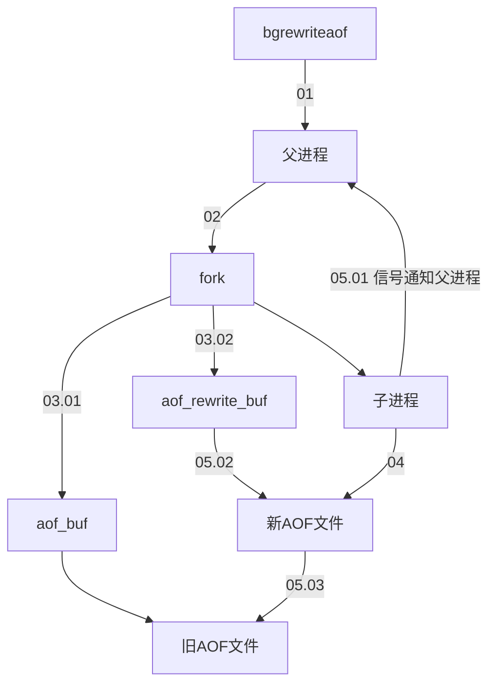
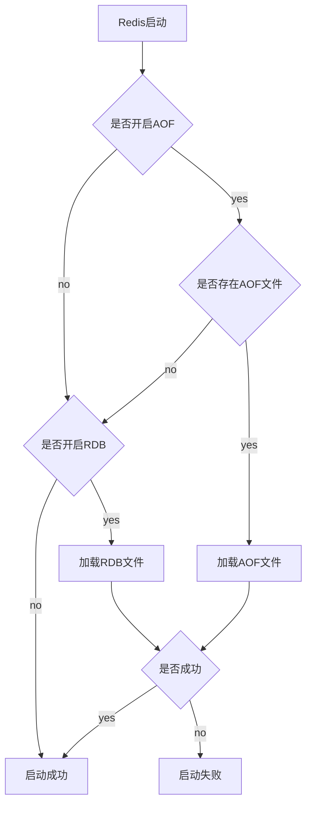

[TOC]

# AOF 的持久化方式

## 介绍

以独立日志的方式记录每次命令，重启时再重新执行 AOF 文件中的命令恢复数据。

AOF 的主要作用是解决了**数据持久化的实时性**，现在已经是 Redis 持久化的主流方式。

## 关于 AOF 方式的配置

1. 开启配置：`appendonly yes`（默认为关闭）
2. 文件的写入位置：`dir`（与 RDB 方式一致）
3. AOF 文件名称：`appendfilename`（默认文件名是 appendonly.aof）
4. 选择 AOF 缓冲区同步文件策略：appendfsync（默认 everysec）

## AOF 的工作流程

AOF 的工作流程操作包含：

1. 命令写入（append）

    所有的写入命令会追加到 aof_buf（缓冲区）中

2. 文件同步（sync）

    AOF 缓冲区根据 AOF 缓冲区同步文件策略向硬盘做同步操作

3. 文件重写（rewrite）

    定期对 AOF 文件进行重写压缩

4. 重启加载（load）

    当 Redis 服务器重启时，可以加载 AOF 文件进行数据恢复

## AOF 缓冲区同步文件策略

根据 AOF 的工作流程中可以看出，AOF 会根据对应的策略向硬盘做同步操作。

Redis 提供了多种 AOF 缓冲区同步文件策略，由参数 `appendfsync` 控制。

| 值       |                             说明                             |                             备注                             |
| :------- | :----------------------------------------------------------: | :----------------------------------------------------------: |
| always   | 命令写入 aof_buf 后调用系统 fsync 操作同步到 AOF 文件，fsync 完成后线程返回。 |        每次写入都要同步，性能取决于 IO，不建议配置。         |
| everysec | 命令写 aof_buf 后调用系统 wite 操作，write 完成后线程返回。fsync 同步文件操作由专门线程每秒调用一次 | **默认且建议**的配置，做到兼顾性能和数据安全性。理论上只有在系统突然宕机的情况下丢失 1 秒的数据（严格来说最多丢失 1 秒数据是不准确的） |
| no       | 命令写入 aof_buf 后调用系统 write 操作，不对 AOF 文件做 fsync 同步，同步硬盘操作由操作系统负责，通常同步周期最长 30 秒 | 每次同步文件的周期不可控，而且会加大每次同步硬盘的数据量，性能提升但安全性无法保证。 |

系统调用 write 和 fsync 说明：

- write 操作会触发延迟写（delayed write）机制。Linux 在内核提供页缓冲区用来提高硬盘 IO 性能。write 操作在写入系统缓冲区后直接返回。同步硬盘操作依赖于系统调度机制，例如：缓冲区页空间写满或达到特定时间周期。

    同步文件之前，如果此时系统故障宕机，缓冲区内数据将丢失。

- fsync 针对单个文件操作（比如 AOF 文件），做强制硬盘同步，fsync 将阻塞直到写入硬盘完成后返回，从而保证了数据持久化。

除了 [write](http://linux.die.net/man/2/write)、[fsync](http://linux.die.net/man/2/fsync)，Linux 还提供了 [sync](http://linux.die.net/man/2/sync)、[fdatasync](http://linux.die.net/man/2/fdatasync) 操作，具体 API 说明直接点击名称连接。

## AOF 文件

### 命令写入文件格式

AOF 命令写入的内容直接是文本协议格式。具体格式可以参考 Redis 客户端通信协议。

> 例如 `set hello world` 这条命令，在 aof_buf 会追加如下文本：
>
> `*3\r\n$3\r\nset\r\n$5\r\nhello\r\n$5\r\nworld\r\n`

> 🤔️：AOF 为什么直接采用文本协议格式？
>
> - 文本协议具有很好的兼容性。
> - 开启 AOF 后，所有写入命令都包含追加操作，直接采用协议格式，避免了二次处理开销。
> - 文本协议具有可读性，方便直接修改和处理。

> 🤔️：AOF 为什么把命令追加到 aof_buf 中？
>
> - 单线程响应命令，如果每次写 AOF 文件命令都直接追加到硬盘，性能完全取决于当前硬盘性能。
> - 写入缓冲区 aof_buf 中，然后根据 Redis 提供的多种 AOF 缓冲区同步文件策略，在性能和安全性方面做出平衡。

### AOF 文件校验

加载损坏的 AOF 文件时会拒绝启动，并打印日志：`# Bad file format reading the append only file: make a backup of your AOF file, then use ./redis-check-aof --fix <filename>`。

采用 `./redis-check-aof --fix <filename> ` 命令进行修复。

修复后使用 `diff -u` 对比数据的差异，找出丢失的数据，有些时候可以人工修改补全。

> AOF 文件可能存在结尾不完整的情况，比如机器突然掉电导致 AOF 尾部文件命令写入不全。
>
> Redis 为我们提供了 aof-load-truncated 配置来兼容这种情况，默认开启。加载 AOF 时，当遇到此问题时会忽略并继续启动，同时打印如下警告日志：
>
> `# !!! Warning: short read while loading the AOF file !!!`
> `# !!! Truncating the AOF at offset 397856725 !!!`
> `# AOF loaded anyway because aof-load-truncated is enabled`

## AOF 的重写机制

为了解决随着写入增多，AOF 文件越来越大的问题，Redis 引入 AOF 重写机制压缩文件体积。AOF 文件重写是把 Redis 进程内的数据转化为写命令同步到新 AOF 文件的过程。

重写既保证了文件体积变小，也保证了加载速度可以变快。

### 遵循的原则

- 已经超时的数据将不再写入文件

- 旧的 AOF 文件含有的无效命令不会写入文件

- 多条写命令可以合并为一个，如：`lpush list a`、`lpush list b`、`lpush list c` -> `lpush list a b c`。

    > 为了防止单条命令过大造成客户端缓冲区溢出，对于 list、set、hash、zset 等类型操作，以 64 个元素为界拆分为多条。

### 触发方式

AOF 重写的触发分为自动触发和手动触发。

#### 自动触发

根据 `auto-aof-rewrite-min-size` 和 `auto-aof-rewrite-percentage` 参数确定自动触发时机。

- `auto-aof-rewrite-min-size`：表示运行 AOF 重写时文件最小体积，默认为 64MB。
- `auto-aof-rewrite-percentage`：代表当前 AOF 文件空间（aof_current_size）和上一次重写后 AOF 文件空间（aof_base_size）的比值。

自动触发时机公式：

`aof_current_size > auto-aof-rewrite-min-size && (aof_current_size - aof_base_size) / aof_base_size >= auto-aof-rewrite-percentage。`

> `aof_current_size` 和 `aof_base_size` 可以在 `info Persistence` 统计信息中查看。

#### 手动触发

执行 `bgrewriteaof` 命令

### 运行流程

1. 执行 AOF 重写请求。

    如果当前进程正在执行 AOF 重写，请求不执行并返回日志：`ERR Background append only file rewriting already in progress`。

    如果当前进程正在执行 bgsave 操作，重写命令延迟到 bgsave 完成之后再执行，返回如下响应：`Background append only file rewriting scheduled`。
    
2. 父进程执行 fork 创建子进程，开销等同于 RDB 的 bgsave 中的 fork 过程。

3. 分为两步：

    1. 主进程 fork 操作完成后，继续响应其他命令。所有修改命令依然写入 AOF 缓冲区并根据 appendfsync 策略同步到硬盘，保证原有 AOF 机制。
    2. fork 操作运用写时复制技术，子进程只能共享 fork 操作时的内存数据。由于父进程依然响应命令，Redis 使用“AOF 重写缓冲区”保存这部分新数据，防止新 AOF 文件生成期间丢失这部分数据。

4. 子进程根据内存快照，按照命令合并规则写入到新的 AOF 文件。

    > 每次批量写入硬盘数据量由配置 `aof-rewrite-incremental-fsync` 控制，默认为 32MB，防止单次刷盘数据过多造成硬盘阻塞。

5. 写入完成后，子进程发送信号给父进程，父进程更新统计信息。

    > 具体见 `info persistence` 下的 `aof_*` 信息

6. 父进程把 AOF 重写缓冲区的数据写入到新的 AOF 文件。

7. 使用新 AOF 文件替换老文件，完成 AOF 重写。

## 持久化功能后的文件加载逻辑

AOF 和 RDB 文件都可以用于服务器重启时的数据恢复。

### 持久化文件加载逻辑

1. AOF 持久化配置开启 && 存在 AOF 文件，使用 AOF 文件加载并打印日志：`* DB loaded from append only file: 5.841 seconds`

2. AOF 关闭或者 AOF 文件不存在 && 开启了 RDB 方式且存在 RDB 文件时，使用 RDB 文件加载，并打印日志：`* DB loaded from disk: 5.586 seconds`。

3. 如果 1，2 都不满足，直接启动

4. 加载 AOF/RDB 文件成功，则 Redis 启动成功

5. 加载 AOF/RDB 文件失败，启动失败 & 打印日志

## Redis4.0 后对于持久化机制的优化

### 介绍

4.0 后开启了对 RDB 和 AOF 的混合持久化方式。

> 可以通过配置：[aof-use-rdb-preamble](x-devonthink-item://DA15BEB3-A579-4509-8A41-AADDB017E206?line=805) 来开启这种混合持久化方式。

如果把混合持久化打开，AOF 重写的时候会把 RDB 内容直接写到 AOF 开头。

### 评价混合持久化

优点：这样可以结合 RDB 和 AOF 的优点，快速加载数据同时避免丢失过多的数据。

缺点：文件中的 RDB 部分不再是支持 Redis 的文本协议的，可读性极差。